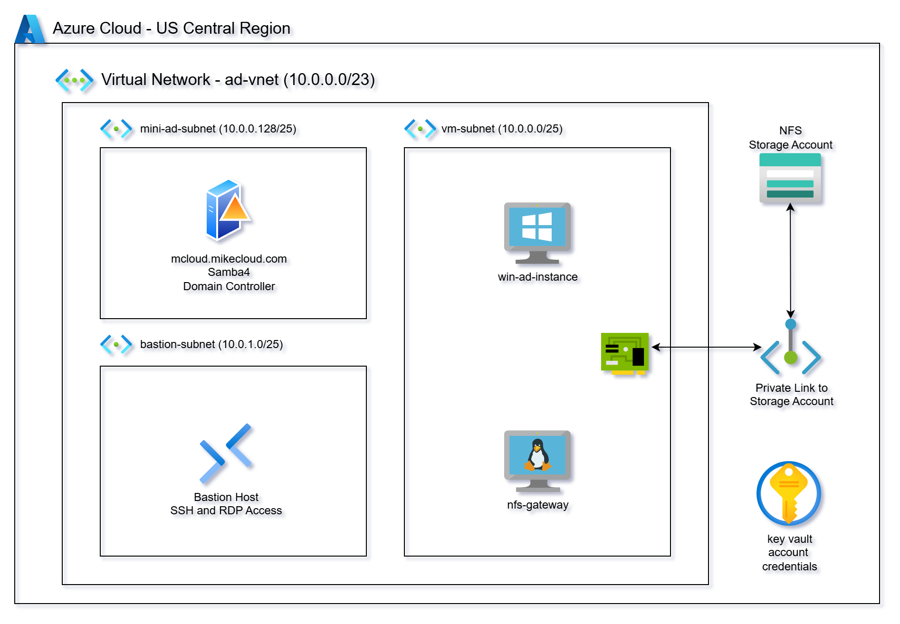
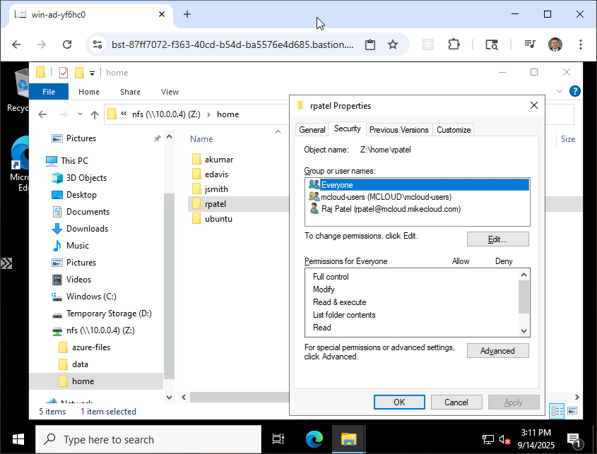
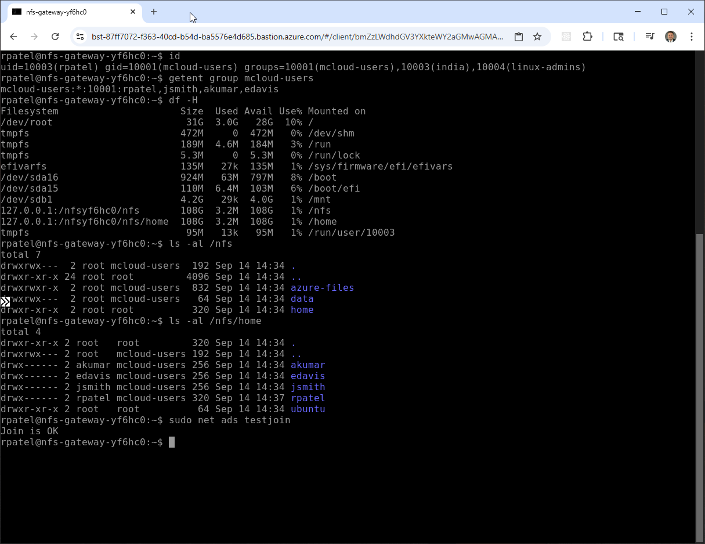

# Azure Mini Active Directory with Azure Files: SMB & NFS File Sharing

This project extends the original **Azure Mini Active Directory** lab by integrating **Azure Files** as a managed shared storage backend. Instead of relying only on local disks or standalone file servers, this solution demonstrates how to expose Azure Files storage in two ways:  

1. **Direct NFS Mounts on Linux Clients** – Linux machines joined to the mini-AD domain mount Azure Files via the NFS 4.1 protocol for scalable, POSIX-compliant storage.  
2. **Native SMB Access** – Windows machines joined to the mini-AD domain access Azure Files directly using SMB, enabling seamless integration with Active Directory authentication.  

The mini-AD environment (Samba 4 on Ubuntu) provides Active Directory authentication and DNS services. Azure Files provides managed SMB/NFS storage with premium performance options. Together, they enable a hybrid setup where both Linux and Windows domain-joined clients can consume Azure-native storage seamlessly.  



## Azure Files with NFS (Linux Integration)

Azure Files supports the **NFS 4.1 protocol**, allowing Linux clients to mount file shares directly. This makes it ideal for POSIX-compliant workloads, multi-node analytics clusters, and containerized applications that expect a native NFS mount.

### Key Features

- **Protocol Support** – Full **NFSv4.1** support (no NFSv3) with strong consistency and support for file locking.  
- **Scalability** – File shares can scale up to **100 TiB** in the standard tier and even larger in the premium tier.  
- **Performance Tiers** –  
  - **Standard (HDD-backed):** Lower-cost, throughput capped per TiB provisioned.  
  - **Premium (SSD-backed):** Consistent low-latency performance with provisioned IOPS and throughput.  
- **POSIX Permissions** – Supports Linux UID/GID semantics and **root squash**, making it suitable for multi-user environments.  

## Why a Samba Gateway is Needed for Windows Access

While Azure Files supports **NFS 4.1** for Linux clients, Windows does not natively support mounting NFS-based Azure Files shares in a domain-integrated, seamless way. Windows clients are designed to use **SMB** for file access and authentication.

Because of this mismatch:

- **Protocol Limitation** – An **Azure Files share must be created as either SMB or NFS**. You cannot mount the same share with both protocols. If both Linux (NFS) and Windows (SMB) access are required against the same dataset, a gateway (such as Samba) is necessary.  
- **Windows ↔ NFS Gap** – Windows clients can technically mount some NFS shares, but support is limited, lacks domain integration, and does not honor Active Directory user/group mappings in the same way as SMB.  
- **Authentication Differences** – NFS enforces access through **POSIX UID/GID mappings**, whereas Windows relies on **Active Directory credentials with Kerberos/NTLM** over SMB. Without a translation layer, Windows can’t map AD identities to NFS ownership properly.  
- **Samba Gateway Role** – A Samba server (joined to the Mini-AD domain) acts as a **protocol translator**:  
  - Frontend: Exposes storage to Windows clients via **SMB shares** with full AD authentication.  
  - Backend: Mounts the Azure Files **NFS share** on Linux, preserving POSIX semantics.  
- **Unified Access** – This allows Linux clients to access the same data natively over NFS, while Windows clients use SMB, both seeing a consistent shared namespace.  

In short, the Samba gateway bridges the protocol and identity gap, making **Azure Files with NFS usable in mixed Linux/Windows environments** where AD-based authentication is required on the Windows side.

## Prerequisites  

* [An Azure Account](https://portal.azure.com/)
* [Install AZ CLI](https://learn.microsoft.com/en-us/cli/azure/install-azure-cli) 
* [Install Latest Terraform](https://developer.hashicorp.com/terraform/install)

If this is your first time watching our content, we recommend starting with this video: [Azure + Terraform: Easy Setup](https://www.youtube.com/watch?v=wwi3kVgYNOk). It provides a step-by-step guide to properly configure Terraform, Packer, and the AZ CLI.

---

## Download this Repository  

```bash
git clone https://github.com/mamonaco1973/azure-nfs-files.git
cd azure-nfs-files
```  

## Build the Code  

Run [check_env](check_env.sh) to validate your environment, then run [apply](apply.sh) to provision the infrastructure.  

```bash
develop-vm:~/azure-files$ ./apply.sh
NOTE: Validating that required commands are in PATH.
NOTE: az is found in the current PATH.
NOTE: terraform is found in the current PATH.
NOTE: All required commands are available.
NOTE: Checking Azure CLI connection.
NOTE: Successfully logged into Azure.
Initializing provider plugins...
Terraform has been successfully initialized!
```  

### Build Results  

When the deployment completes, the following resources are created:  

- **Networking:**  
  - A VNet with public and private subnets  
  - Azure Bastion for secure RDP/SSH without public IPs  
  - Route tables configured for AD, clients, and storage access  

- **Security & Identity:**  
  - NSGs for domain controller, Linux client, Windows client, and storage access  
  - Azure Key Vault for credential storage (admin + user accounts)  
  - Managed Identities for VM-to-Key Vault secret retrieval  

- **Active Directory Server:**  
  - Ubuntu VM running Samba 4 as Domain Controller and DNS server  
  - Configured Kerberos realm and NetBIOS name  
  - Administrator credentials stored in Key Vault  

- **Client Instances:**  
  - Windows VM joined to the domain via boot-time PowerShell script  
  - Linux VM joined to the domain with SSSD integration via cloud-init  

- **Azure Files Storage:**  
  - Premium Storage Account with SMB and/or NFS protocol enabled  
  - File shares provisioned for shared data and home directories  

- **File Access Integration:**  
  - A Linux VM mounts the Azure Files NFS share  
  - The same Linux VM exposes the mounted share via **Samba**, acting as a gateway for Windows clients  
  - This enables domain-joined Windows machines to access Azure Files storage transparently using SMB, while Linux clients mount NFS directly  

### Users and Groups  

The domain controller provisions **sample users and groups** via Terraform templates. These are intended for testing and demonstration.  

#### Groups Created  

| Group Name    | Category  | Scope     | gidNumber |
|---------------|-----------|----------|-----------|
| mcloud-users  | Security  | Universal | 10001 |
| india         | Security  | Universal | 10002 |
| us            | Security  | Universal | 10003 |
| linux-admins  | Security  | Universal | 10004 |

#### Users Created  

| Username | Full Name   | uidNumber | gidNumber | Groups Joined                    |
|----------|-------------|-----------|-----------|----------------------------------|
| jsmith   | John Smith  | 10001     | 10001     | mcloud-users, us, linux-admins   |
| edavis   | Emily Davis | 10002     | 10001     | mcloud-users, us                 |
| rpatel   | Raj Patel   | 10003     | 10001     | mcloud-users, india, linux-admins|
| akumar   | Amit Kumar  | 10004     | 10001     | mcloud-users, india              |


### Log into Windows Instance  

When the Windows instance boots, the [ad_join script](02-servers/scripts/ad_join.ps1.template) executes the following tasks:  

- Install Active Directory Administrative Tools  
- Install AWS CLI  
- Join EC2 instance to Active Directory  
- Grant RDP access to domain users  
- Perform a final system reboot  

Administrator credentials are stored in the `admin_ad_credentials` secret.



### Log into Linux Instance  

When the Linux instance boots, the [custom data script](02-servers/scripts/custom_data.sh) runs the following tasks:  

- Update OS and install required packages  
- Install AWS CLI  
- Join the Active Directory domain with SSSD  
- Enable password authentication for AD users  
- Configure SSSD for AD integration  
- Grant sudo privileges to the `linux-admins` group  
- Configure instance as a Samba file gateway to NFS

Linux user credentials are stored as secrets.




### Clean Up  

When finished, remove all resources with:  

```bash
./destroy.sh
```  

This uses Terraform to delete the VNet, VMs, Key Vault, storage accounts, NSGs, and secrets.  


